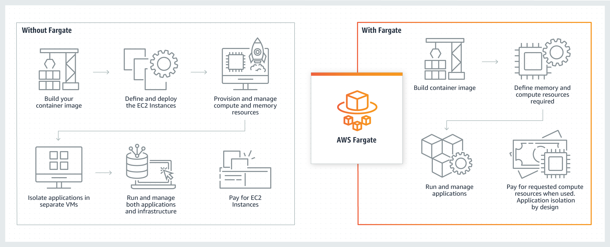
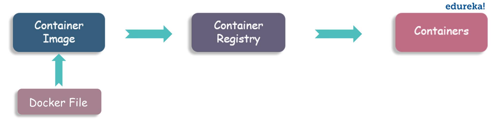
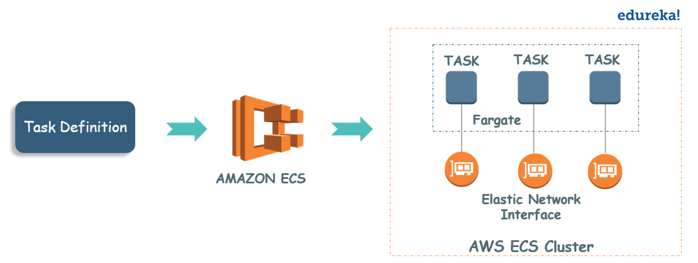
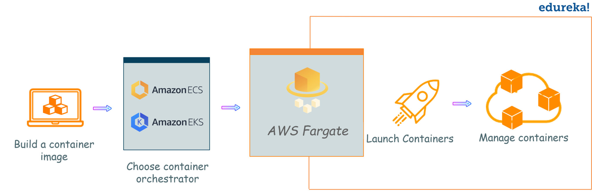

# AWS Fargate

## Que es ?
Es un `serveless` que corre en `ECS (Amazon Elastic Container Service)` o `EKS (Amazon Elastic Kubernetes Service)`, se centra en la creacion de aplicaciones, eliminando la necesidad de administrar un servidor y aislando su aplicacion por diseño.

## Beneficios:
* Implementar aplicaciones sin infraestructura.
* Recursos de tamalo flexible a buen precio
* Aislammiento seguro por diseño.
* Capacidad completa de monitorear las aplicaciones.

## Funcionamiento:

* **Container:** Contiene todo lo necesario para ejecutar su codigo, tiempo de ejecucion, herramientas del sistema, bibliotecas del sistema, etc.
Se crean apartir de plantillas ('`Container image`').
* **Container image:** Es un archivo sin formato en donde especifica todos los componentes del contenedor.
Estas imagenes se almacenan en un registro desde la que se pueden descargar y ejecutar.

* **Task Definitions:** Es un archivo JSON que describe los contenedores que posee la aplicacion.
* **Task:** Es la instancia de una definicion de tarea dentro de un cluster, Se puede especificar la cantidad de tareas que ejecutara el cluster.
* **Clusters:** Es la agrupacion de recursos basicos que requiere la aplicacion.

# Como se implementa?

* Se debe crear una imagen del contenedor.
* Se almacena en un registro.
* Luego se elije el sistema de orquestacion de los contenedores `ECS` o `EKS`.
* Asigna recursos a la aplicacion.
* Se deben crear clusteres, para agrupar los recursos asignados.
* Se elije el tipo de lanzamiento AWS Fargate.
* Se lanzara y ejecutara sus contenedores.
