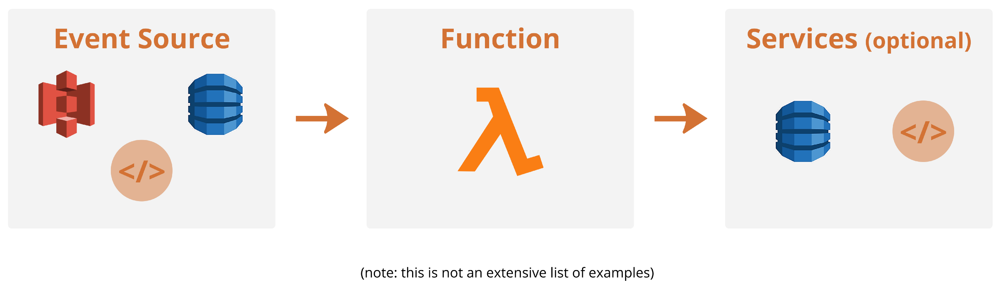

# AWS Lambda

## Que es?

Practicamente es un `Serverless`, este concepto de sin servidor, no es del todo verdadero; consiste en dejar de usar servidores fisicos o servidores en la nube, todo esto se da por medio de contenedores temporales que no poseen estado donde ejecutan el  codigo de las aplicaciones, estos contenedores se crean en el momento en que se ejecuta la aplicacion y luego desaparecen, aca es donde los servidores pasan a ser la parte menos visible del sistema.

AWS Lambda es un servicio informatico basado en funciones que elimina los esfuerzos de aprovisionamiento y mantenimiento de su infraestructura fuera de sus manos. Ya con este servicio no tenemos que preocuparnos por escalar su infraestructura y eliminar recursos innecesarios, ya que todo se maneja por usted.

## Ventajas!! ... 

1. Adoptar un enfoque sin servidor.
2. Ahorrar tiempo, esfuerzo y mantenimiento de una infraestructura.
3. Permite comercializar la aplicacion lo mas rapido posible.
4. Permite ejecutar sus funciones `Lambda` de manera simultanea.
5. Se paga solo por lo que se necesita.
6. `AWS` nos cobra por la cantidad de solicitudes que reciben sus funciones de `Lambda` y tiempo que lleva para ejecutarla. 
7. Se integra de manera facil con otros servicios.

## Desventajas!! ...

1. Menos control y flexibilidad.
2. las funciones expiran despues de 15 minutos.
3. La cantidad de `RAM` disponible varia de `128MB` a `3008mb` con un incremento `64MB` entre cada opcion.
4. El codigo de Lambda no debe superar los `250MB` y la version comprimida no debe supear los `50MB`.
5. Hay un limite de `1.000` solicitudes que pueden ejecutarse simultaneamente, cualquier solicitud por encima de este limite se limitara y debera esperar a que otras funciones terminen de ejecutarse. 
6. Puede que la solucion no sea la mas barata, depende de su necesidad.

## Como funciona ?

En un nivel bastante basico:

* **Event Source:**
Equivale a cualquier cosa que pueda realizar un llamado a una funcion.
* **Function:**
Se ejecutara en su propio contenedor, asignandole recursos, el tamaño se le asignara por el peso de los datos que posea y sus requisitos computacionales dependen del uso que requiera la funcion.
* **Funciones Lambda:**
Para poder ejecutar una funcion, debera crear una y para hacerlo implica:
    * **Funcion controlador:** Es la funcion que se ejecutara al momento de la invocacion, puede ser asincrona o no asincrona. 
    * **Objeto de evento:** Contiene los datos que se enviaron cuando se activo el evento de la funcion.
        * Cuerpo de la solicitud.
        * La uri.
        * Los datos varian dependiendo del servicio de invocacion.
    * **Objeto contexto:** Contiene informacion de tiempo de ejecucion.
        * Como el nombre de la funcion.
        * Version dela funcion.
        * Grupo de registro. 
    * **Funcion de devolucion de llamada:** Solo llaman controladores sincronos y toman dos valores (error / respuesta).
* **Fin de la creacion:** Al finalizar la creacion se envia AWS, se comprime junto sus dependencias y sealmacena en un bucket de `S3`.

# **Layers**
En este lugar se ponen las piezas de codigo que se desean reutilizar en multiples funciones `Lambda`.
* Ayuda a mejorar la capacidad de mantenimiento y limpieza de las funciones `Lambda`.
* Ayuda a reducir la cantidad de codigo.
* Reduce duplicidad de codigo.

# **Versioning and Aliases**
Permite guardar diferetes versiones de sus funciones `Lambda` y que ambas versiones coexistan y se ejecuten al mismo tiempo. Con los alias sirven como punteros a las distintas funciones `Lambda`.

# **Permissions**
Las funciones por defecto ya son seguras, ya que no se puede comunicar con otros servicios y ni ser llamadas por ningun cliente.Existen dos tipos de permisos:
* **Politicas de ejecucion:** Determinan a que servicios y recursos tiene acceso una funcion de `Lambda`,asi como fuentes de eventos que la activen.
* **Politicas basadas en recursos:** Otrogan aceso a otras cuentas y servicios de AWS.

# **Resilience**
Es la manera en que una funcion `Lambda` pueda dar manejo de errores, sin afectar toda la aplicacion.
Gracias a sus caracteristicas:
* Su escalabilidad.
* Control de versiones.
* Capacidad de ejecutarse simultaneamente.
* Multiples zonas de disponibilidad.
* Capacidad de reservar simultaneidad.

# **Cold Starts**
Se producen cuando la funcion no a sido llamada por un tiempo prolongado, segun varios experimentos el tiempo seria `45 min` a `60 min`. Estos arranques se demoran ya que tienen que volver a montar toda la funcion `Lambda`. 
