# Amazon Elastic Compute Cloud (EC2)
Es un servicio web que ofrece capacidad informatica en la nube de forma segura y de tamaño modificable.
Proporciona un control sobre los recursos informaticos y puede ejecutarse en el entorno informatico acreditado `Amazon`.

## Componentes basicos
* **Innovacion mas rapida y mayor seguridad con el sistema nitro AWS:** El sistema consiste en una completa colección de bloques de creación que pueden acoplarse de muchas formas distintas, de modo que contamos con flexibilidad para diseñar y entregar con rapidez nuevos tipos de instancias `EC2`, con una selección de opciones de informática, almacenamiento, memoria y red más completa que nunca.
* **Eleccion de procesadores:** 
    * CPU:
        * Intel Xeon.
        * AMD EPYC.
        * AWS Graviton.
    * GPU:
        * NVIDIA.
        * AWS Inferentia.
* **Almacenamiento de alto rendimiento:** 
    * Amazon Elastic Block Store (EBS) proporciona almacenamiento de bloques persistente, de alto rendimiento, facil de usar y diseñadoara su uso con `EC2`.
    * Almacenamiento local `SSD` de NVMe.
* **Redes mejoradas:** Es la primera y unica nube que ofrece una red de ethernet de `400Gbps`, estas redes tiene un rendimiento de paquetes por segundo mas alto, reduccion del ruido en la red y menor latencia.
* **Eleccion de modelo de compra:** 
    * Bajo demanda.
    * Instancias de Spot.
    * Savings Plan.

# Virtual Private Cloud (VPC)
Es una red virtual privada totalmente aislada, se puede definir como nosotros queramos darle uso.
En esta red se puede crear rangos de IPs, creacion de subredes, manejo de las tablas de enrutamiento y gateways de la red.

## Beneficios de utilizar VPC
* Conexiones de forma segura y facil de monitorear.
* Su uso y configuracion es facil.
* Es una red virtual personalizable.

## Casos de uso
* Alojamiento de un sitio web sencillo con acceso publico.
* Alojamiento de aplicaciones web con varios niveles.
* Para la realizacion de copias de seguridad y recuperar los datos despues de un desastre.
* Ampliacion de la red corporativa hacia la nube.
* Conexiones seguras entre la nube y los centros de datos.

## Sus caracteristicas
* Analizador de accesibilidad.
* Registros de flujos de la VPC.
* Replicacion de trafico de VPC.
* Direccionamiento de entrada.
* Grupos de seguridad.
* Lista de control de acceso a la red (ACL).

## Crear una instancia de EC2 por la consola de AWS
1. Lo primero que vamos a buscar es VPC.
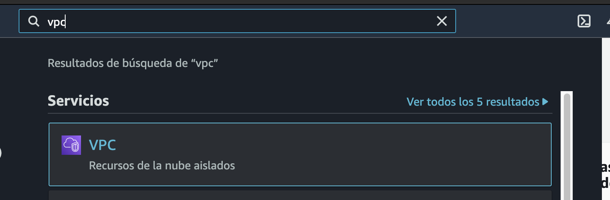
2. Vemos el listado de las VPCs. (Eliminamos las VPC que nos encontremos por default)
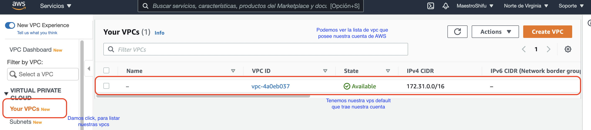
3. Buscamos EC2 en la consola de AWS, al ver el panel principal buscamos `Pares de claves` y si existen algunas las eliminamos. 
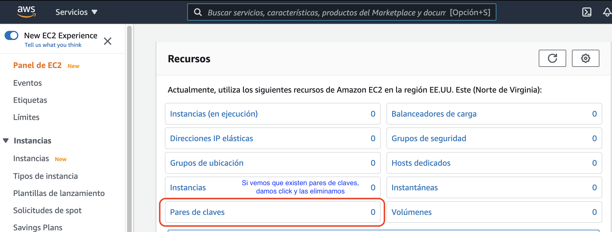
4. Vamos a lanzar nuestra instancia EC2.
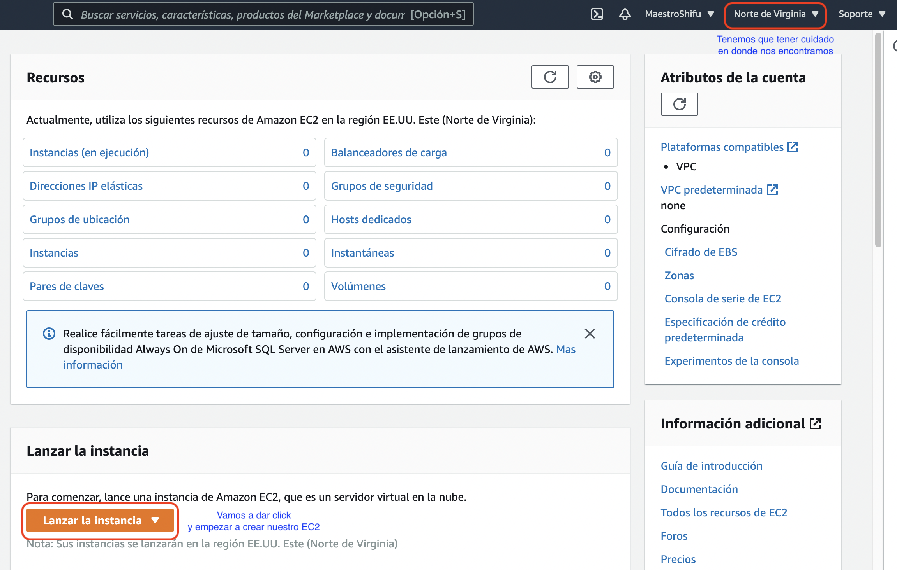
5. Seleccionamos el tipo de imagen y la arquitectura que requerimos.
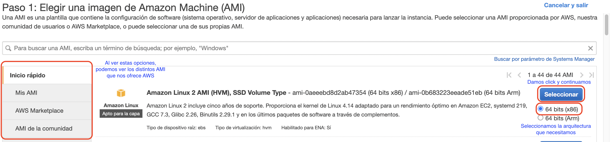
6. Seleccionamos el tipo de instancia que deseamos.
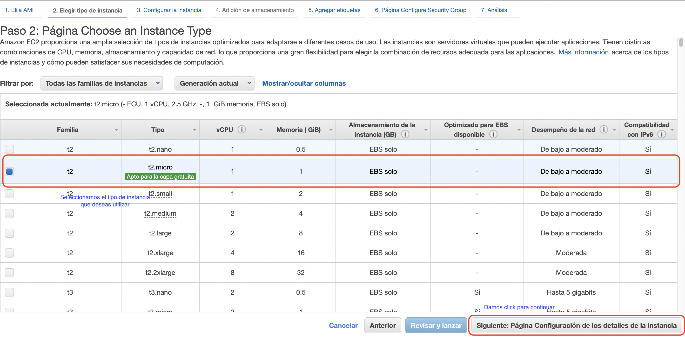
7. Requerimos crear nuestra VPC.
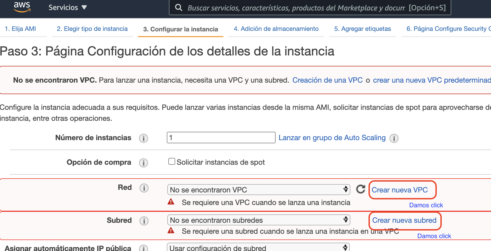
8. Para evitarnos la configuracion completa, vamos a actions y buscamos la creacion del PVC or default.
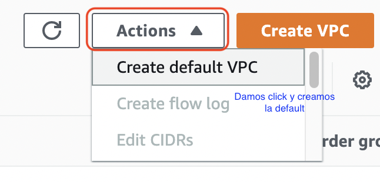
9. Al tener la VPC creada, refrecamos y vemos como la data se llena automaticamente (Es una buena practica usar siempre un sistema de VPC y manejo de capas en la red).
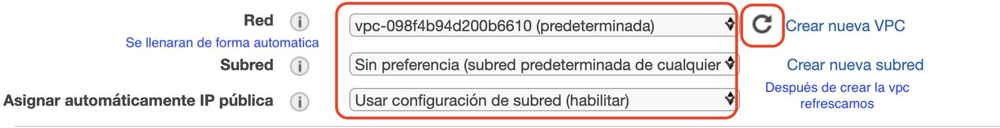
10. Agregamos un codigo en ssh para realizar la demostracion de su funcionamiento
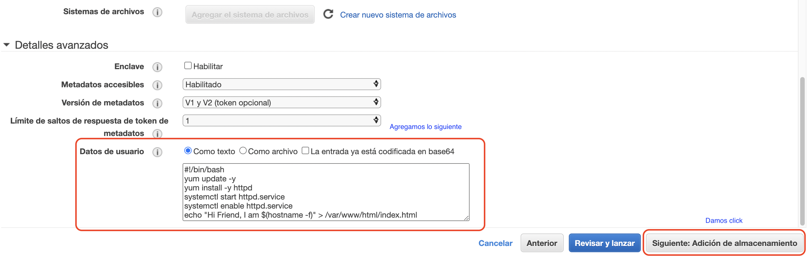
11. Seleccionamos los volumenes que se utilizaran en nuestra instancia.
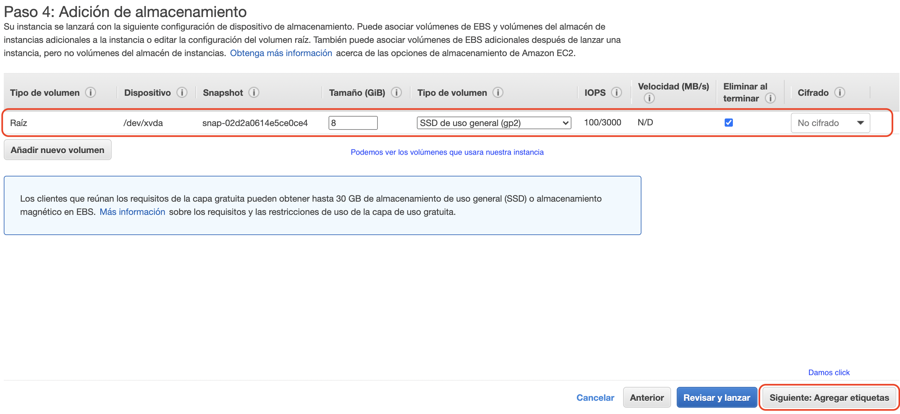
12. Agregamos un tag a nuestro EC2.
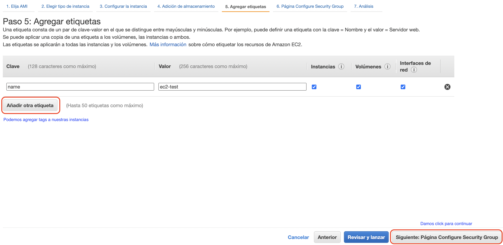
13. Seleccionamos el grupo de seguridad que contiene nuestra VPC por default.
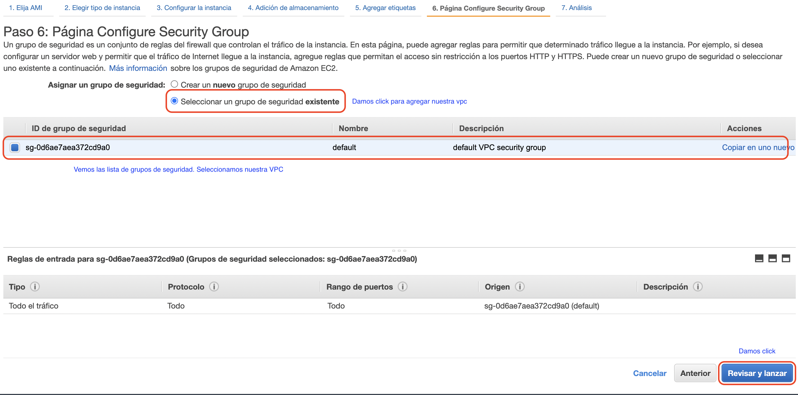
14. Vemos la descripcion de nuestra instancia EC2.
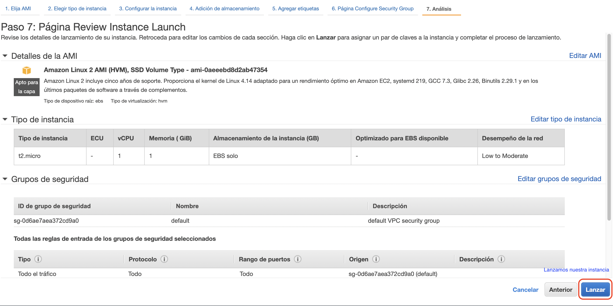
15. Vamnos a crear una clave de acceso para poder administrar nuestra instancia.
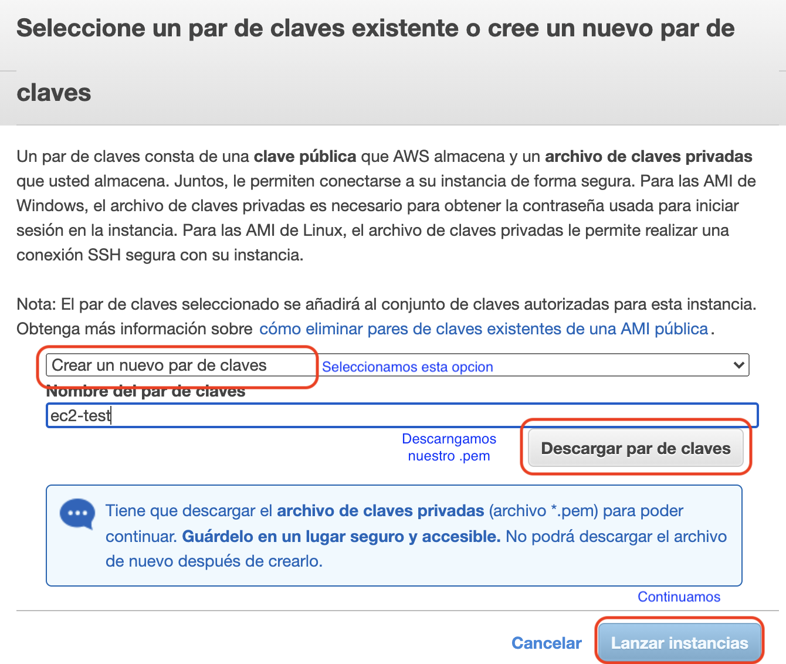
16. Podemos ver la lista de nuestras instancias y una breve descripcion de la misma.
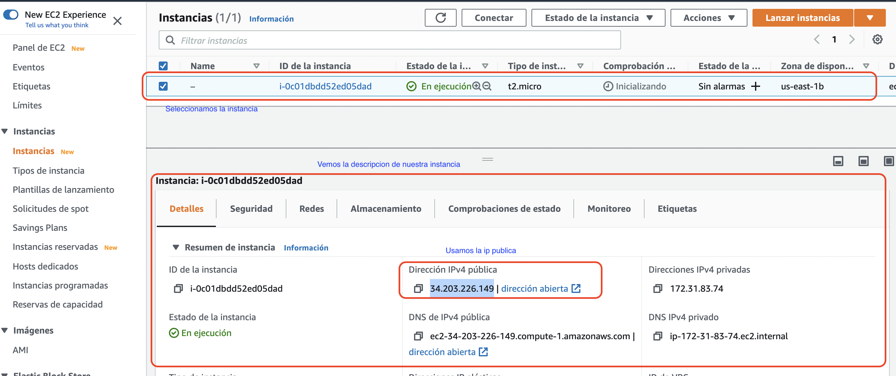
17. Para poder ver lo que usamos en el SSH, solo requerimos agregar una nueva recgla de entrada a nuestro grupo de seguridad (HTTP Y SSH).
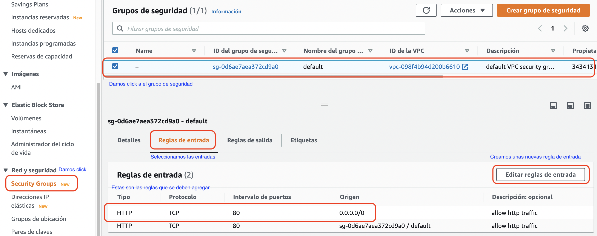
18. Usamos nuestra ip publica de la instancia y vemos que esta funcionando!!
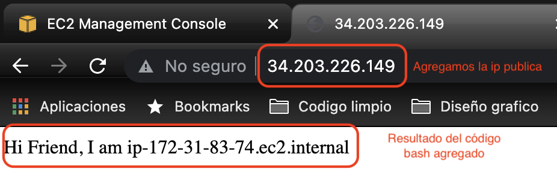
19. De esta manera damos permisos a la llave que descargamos y ingresamos por ssh a nuestra instancia de EC2
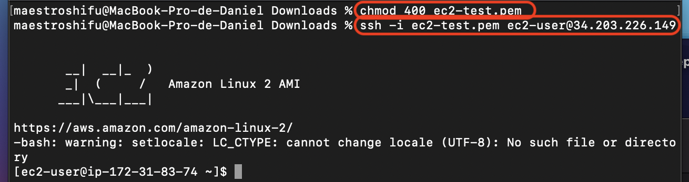
