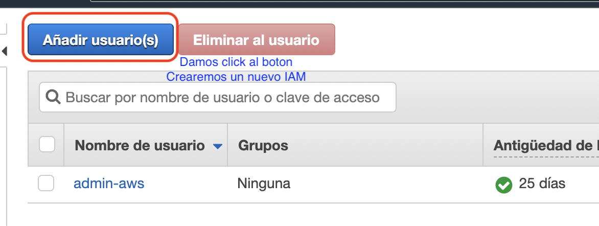
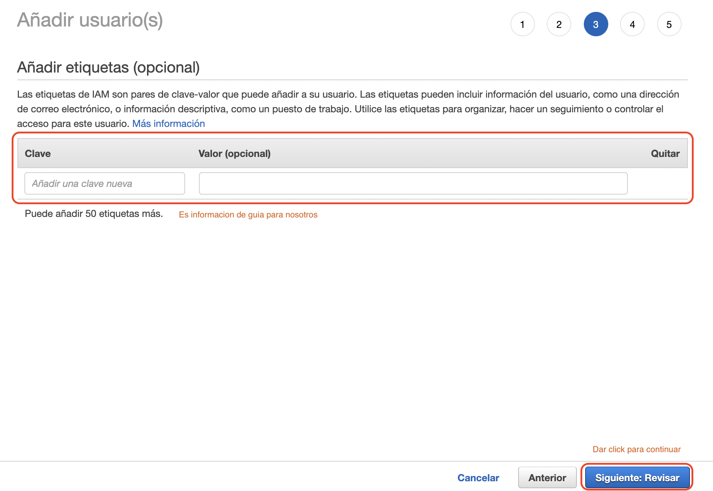

# IAM
Es un servicio web que ayuda a controlar de forma segura el acceso a los recursos de `AWS`, tambien nos ayuda a controlar quien esta autenticado y autorizado.
Nuestro primer `IAM` se crea con el email de inicio de creacion de nuestra cuenta de `AWS`, por buenas practicas el ideal es no usarla para actividades administrativas de los servicios.

## Caracteristicas
* **Acceso compartido a la cuenta de AWS:** Puede conceder acceso a otras personas para que puedan acceder a los recursos de la cuenta `AWS`.
* **Permisos detallados:** Puede conceder permisos a diferentes personas para diferentes recursos.
* **Acceso seguro a los recursos de AWS para aplicaciones que ejecutan en Amazon EC2:** Proporciona de manera segura acceso a aplicaciones que se encuentran en servicios `EC2`.
* **Multi-Factor authentication (MFA):** Puede crear autenticacion de dos factores para mayor seguridad.
* **Identidad federada:** Se puede dar acceso desde otras cuentas administrativas de trabajo.
* **Informacion de identidad para realizar un control:** Son el manejo de logs de cada uno de los usuarios.
* **Conformidad de DSS de PCI:** Manejo de datos de tarjeta de credito entre los usuarios.
* **Integracion con muchos servicios de AWS:** Maneja una lista de servicios de `AWS`.
* **Consistencia final:** Maneja una alta disponibilidad.
* **Uso gratuito:** Son funciones de uso gratuito de la plataforma.

## Acceso 
* Consola administrativa de `AWS`.
* Herramienta de linea de comandos.
* SDK de `AWS`.
* API https de IAM.

## Crear un usuario IAM desde la consola de AWS
1. Buscamos IAM.

2. Vemos un resumen de los recursos que posee nuestro IAM.

3. Vamos a encontrar una lista con los IAM que tenemos en nuestra cuenta de AWS.

4. Agregamos la informacion que queremos para nuestro IAM.

5. En esta ventana vemos los grupos y permisos que le daremos a nuestro IAM.

6. Podemos agregar tags a nuestro usuario IAM. Esto es opcional!!

7. Vemos la descripcion de nuestro usuario en como se va a crear.

8. Tenemos las keys y secretos de nuesra cuenta IAM. Ya creamos nuestra IAM de forma satisfactoria :3.

