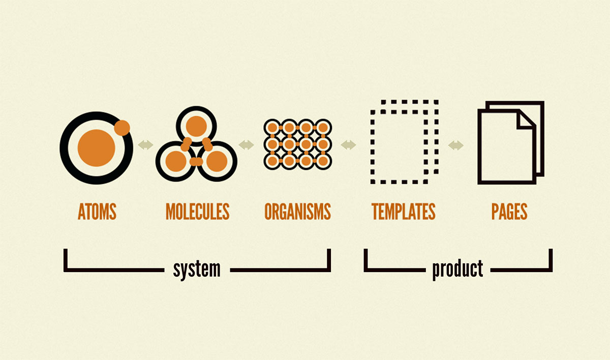
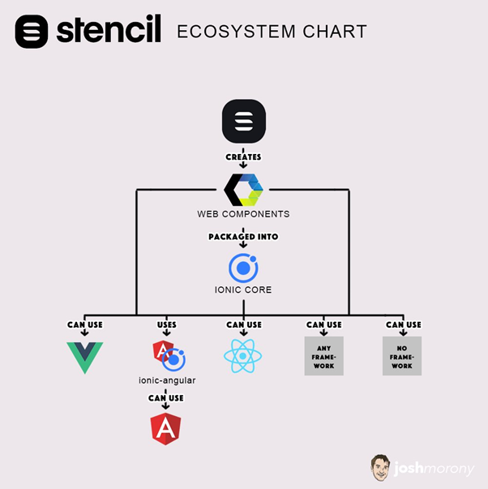
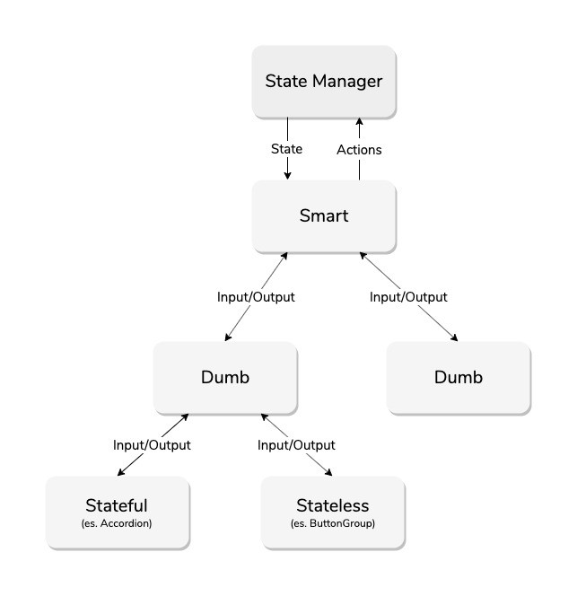
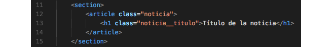
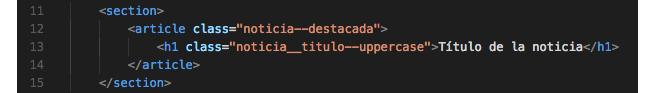

# Atomic Desing

* **Quarks:** Son los elementos mas basicos de una web, como assets, estilos, etc.

* **Atomic:** Son las estructuras funcionales mas pequeñas que son individuales. Cada uno de ellos tiene propiedades y se pueden combinar.
* **Molecules:** Es la union de distintos atomos, obteniendo propiedades unicas y convirtiendodes en elementos mas funcionales. (Eventos, validaciones, transformacion y  retroalimentacion de las mismas).
* **Organisms:** Conjunto de moleculas funcionando como una sola unidad (Pueden ser desde organismos unicos hasta organismos mas complejos). Se encarga tambien de orquestar el comportamiento de cada una de las moleculas (Validaciones unificadas, eventos globales, etc).

* **Template:** Son componentes autosuficientes, pueden incluir consumos de Apis que complementen su comportamiento. Son widgets stateless.

# Web components

## Generalidades: 

* **Reutilizables:** Se crean para que sean usados en cualquier front que se construya en las tecnologias compatibles (React, Vue, Angular).
* **Agnostico:** Son implementados con un alto nivel de abstraccion, los cuales no generan ningun acoplamiento negativo con el consumidor y pueden ser utilizados sin ninguna coodependencia con otro componente.
* **Flexibles:** Son componentes que basado en una serie de atributos que exponen a sus consumidores permiten renderizar adecuadamente en cada uno de los ambientes en donde se ejecute.

## Caracteristicas: 

* Custom elements.
* HTML Templates.
* Shadow DOM.

# Components

* **Stateless:** No posee un estado interno, es impulsado por el padre que le da todo lo que necesita en este momento.
* **Statefull:** Puede ser guiado por el padre, pero tambien posee un estado interno para mayor comodidad.
* **Dumb/Presentional:** No tiene dependencias del resto de la aplicacion (Aparte de las que necesita para existir, obviamente)
* **Smart/Container:** Puede contener dependencias externas, organiza la ruta usando componentes `Dump` se encarga de pasar el estados a los componentes hijos y utiliza sus eventos para actualizar el esatdo global (o su esatdo). 

# Metodologia BEM

Propone un estilo descriptivo para nombrar cada una de las clases a utilizar, permitiendo asi crear una estructura de codigo consistente.

## Objetivo

* Se centra en la reutilizacion de codigo.
* Nos da un mayor entendimiento hacia a que nos referimos.
* Crea una documentacion explicita en cada declaracion.

## Se centra en 3 parametros:

* **Bloques:** Es un contenedor en donde se encontraran los diferentes elementos. El bloque de elementos corresponde a la raíz de la clase y deberá ir siempre primero. Cuando ya está definido es posible nombrar los elementos que compondrán la estructura final y su contenido.
    * HTML: 
        
    * CSS:
        
* **Elementos:** El elemento es una de las variadas piezas que compondrán la estructura de un bloque. El bloque es el todo y los elementos son las piezas de este bloque.
De acuerdo a la metodología BEM, cada elemento se escribe después del bloque padre, usando dos guiones bajos.
Al convertirse en el centro de los nombres de las clases, los elementos ayudan a entender cómo estructurar y manejar las hojas de estilos una vez que se empiece a diseñar el proyecto. Por esto, es importante usar nombres claros y precisos.
    * HTML: 
        
    * CSS:
        
* **Modificadores:** El ejercicio de nombrar las clases sirve para que los elementos puedan repetirse. Si los elementos son los mismos, no será necesario escribir nuevas clases en otras áreas del sitio.
Para modificar el estilo de un elemento específico, existen los modificadores. Estos se usan agregando un doble guión justo después del elemento o bloque que se quiere modificar.
    * HTML: 
        
    * CSS:
        

## Ventajas:
* Añade especificidad.
* Aumenta la independencia.
* Mejora la heriencia multiple.
* Permite la reutilizacion.
* Entrega simplicidad.

## Contras:
* Puede tomar tiempo aprender la terminologia.
* Las convenciones pueden ser muy largas.
* El sistema de organizacion puede ser dificil de implementar. 