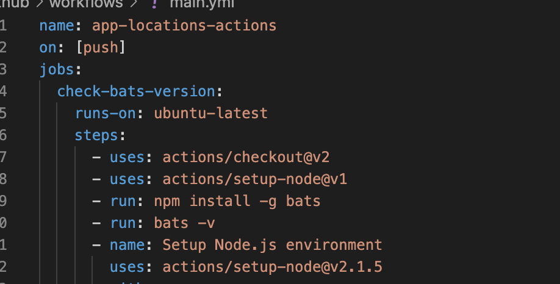

# Git Hub Actions

# Introduccion a las acciones de github
* Un `event` desencadenara un `workflow`.
* Un `workflow` contiene uno o mas `jobs`.
* Un `jobs` se ejecutara en un `runner` y contendra uno o mas `steps`.
* Un `step` contendra una sola `action` o una serie de comandos en linea.
* La ejecucion puede generar `artifacts` y usar cache una `cache`.

# Componentes
* **Runner:** Es cualquier maquina con la aplicacion de github.
* **Action:** Son las tareas individuales que se pueden combinar como pasos para crear un trabajo.
* **Step:** Es una tarea individual que puede ejecutar una serie de comandos o una sola accion.
* **Job:** Es un grupo de pasos, todos ellos compartiran el sistema de archivos.
* **Workflow:** Es el proceso automatizado general que se compone de uno o mas trabajos. Usted define el flujo de trabajo usando archivos YAML y estos se guardan junto con el codigo de su aplicacion en el directorio.
* **Dependency caching:** Es una tecnica comun al crear una canalizacion de CI/CD, ya que permite ahorrar tiempo en descargas repetidas de las dependencias. 

# Ejemplo de implementacion
* En nuestro repositorio creamos `.github/workflows/`.
* Dentro de este directorio creamos el archivo `.yaml`.
* Agegamos los cambios y realizamos push a nuestro repositorio.

Para mas informacion [Aqui](https://docs.github.com/en/actions/learn-github-actions/introduction-to-github-actions)