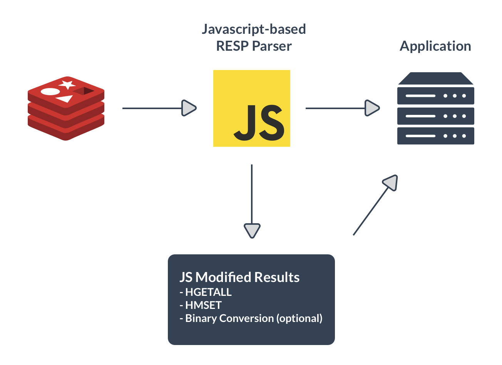

# Redis

## Que es redis?
Redis es un almacén de estructura de datos de valores de clave en memoria rápido y de código abierto. 

## Ventajas
* Desempeño increíblemente rápido.
* Estructuras de datos en memoria (512MB).
* Versatilidad y facilidad de uso.
* Replicación y persistencia.
* Compatibilidad con su lenguaje de programación favorito.

## Casos de uso
* Almacenamiento en cache.
* Administracion de sesiones.
* Clasificaciones en tiempo real.
* Limitacion de velocidad.
* Colas
* Chat y mensajeria.

## Ejemplo de implementacion

