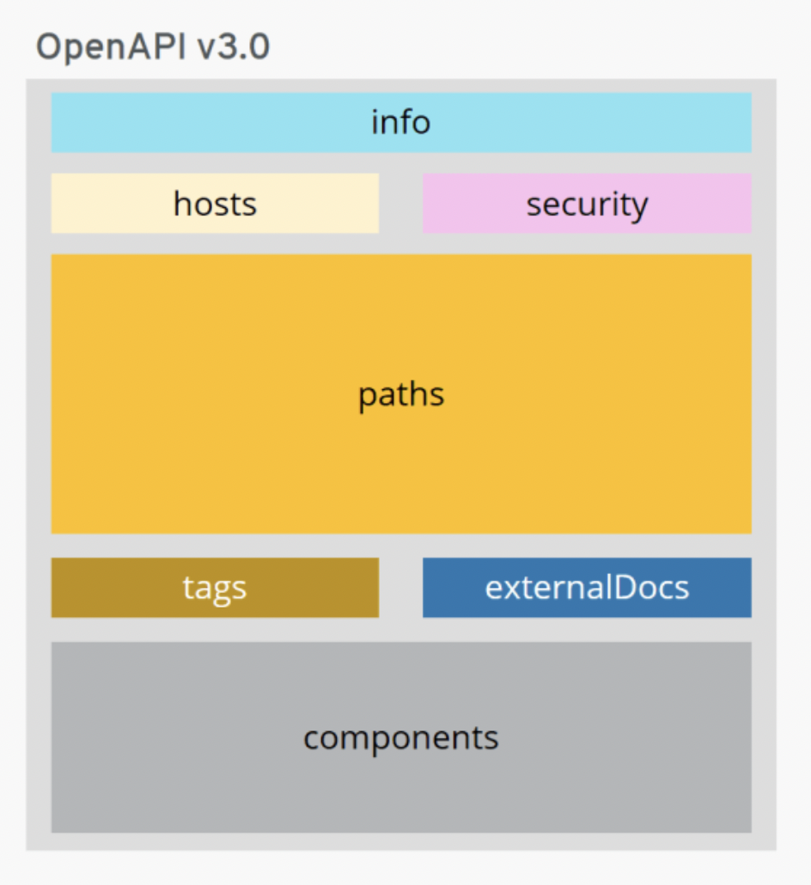

# OpenAPI
Las especificaciones `OAS` establece un marco comun para los diseñadores, desarrolladores y testers sobre como construir y mantener las `APIs`.

[Herramientas para OpenAPI desarrollo](https://openapi.tools/)

## Estructura de OpenAPI

* **INFO: [OBLIGATORIO]** Esta la metadata asociada a los contratos con el `API`, en esta seccion va el titulo, la version y la descripcion.
* **HOSTS / SERVERS: [OBLIGATORIO]** Es mas orientada a los clientes ya que comunica donde se encuentran los servidores de nuestra `API`, a travez de su `URL`.
* **SECURITY:** Es definir nuestro protocolo de seguridad para el uso de nuestra `API`.
* **PATHS:** Muestra los `endpoints` o `recursos` que expone nuestra `API` y los distintos metodos `HTTP` correspondiente.
* **TAGS:** Sirven para agrupar varias operaciones.
* **EXTERNAL DOCS:** Permite hacer referencia a documentacion externa para facilitar el consumo y la integracion con el `API`.
* **COMPONENTS:** Son objetos que pueden contener un conjunto de objetos reutilizables durante el diseño del `API`.

## Orden de OpenAPI

1. OpenAPI object.
2. Info object.
3. Server object.
4. Paths object.
5. Components object.
6. Security object.
7. Tags object.
8. ExternalDocs object.

## Ventajas

* Nos permite centrarnos directamente en los consumidores, obstrayendo los problemas que puedan presentarse a futuro.
* Reduce la dependencia entre los equipos que van a trabajar con la `API`.
* `Contrat first` nos permite sentarnos primero a definir para que va a servir y para quien.
* Nos ayuda como a nivel de documentacion.
* Tiempo del lanzamiento del `API` es mas reducido.

## Herramientas utiles

* Definicion de la API:
    * [Swagger editor](https://editor.swagger.io/).
    * [OpenAPI GUI](https://mermade.github.io/openapi-gui/).
    * [Apibldr](https://www.apibldr.com/).
* Pruebas durante el desarrollo de la API:
    * [Swagger inspector](https://inspector.swagger.io/builder).
    * [SOAP Gui](https://www.soapui.org/).
    * [Postman](https://www.postman.com/).
* Generacion de la API:
    * [OpenAPI Generator](https://openapi-generator.tech/).
    * [Swagger Codegen](https://swagger.io/tools/swagger-codegen/).

## Ciclo de implementacion
* Tener muy claro las funcionalidades que vamos a definir en nustra `API`.
* Empezamos a definir nuestra `API`.
* Validar el funcionamiento de nuestra `API` para poderla validar correctamente.
* Ya podemos impementar la `API`.
* Realizar las pruebas de verificacion a groso modo para poder probar la funcionalidad de nuestra `API`.
* Se pasa a despliegue de la misma.

## Mejores practicas

* Utilizar el enfoque de diseño primero:
    * `Code-first` El `API` se implementa primero en codigo y luego se crea si descripcion a partir de ella.
    * `Desing-first` La descripcion de la `API` se escribe primero y luego sigue el codigo.
* Mantenga una unica fuente de la verdad.
* Agregar documentos de OpenAPI al control de codigo fuente.
* Poner los documentos de OpenAPI a disposicion de los usuarios.
* Rara vez es necesario escribir documentos de OpenAPI a mano:
    * Editores de OpenAPI.
    * Idiomas especificos del dominio.
    * Anotaciones de codigo.
* Trabajar con documentos grandes
    * No repitas la misma pieza de `YAML` o `JSON` en el mismo documento, puedes moverlo como componente y hacer referencias con [$ref](https://oai.github.io/Documentation/specification-components.html).
    * Divida el documento en varios archivos.
    * Utilice las etiquetas para mantener las cosas organizadas.