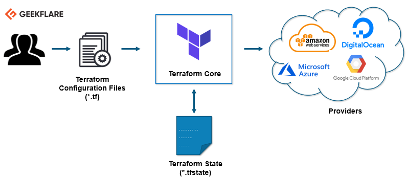

# Terraform

Es una infraestructura de código abierto como herramienta de código desarrollada por HashiCorp. Se utiliza para definir y aprovisionar la infraestructura completa utilizando un lenguaje declarativo fácil de aprender.

## Conceptos basicos:

* **Variables:** También se utiliza como variables de entrada, es un par clave-valor utilizado por los módulos Terraform para permitir la personalización.
* **Proveedor:** Es un complemento para interactuar con las API de servicio y acceder a sus recursos relacionados.
* **Módulo:** Es una carpeta con plantillas Terraform donde se definen todas las configuraciones
* **Estado:** Consiste en información en caché sobre la infraestructura administrada por Terraform y las configuraciones relacionadas.
* **Recursos:** Se refiere a un bloque de uno o más objetos de infraestructura (instancias de cómputo, redes virtuales, etc.), que se utilizan para configurar y administrar la infraestructura.
* **Fuente de datos:** Los proveedores lo implementan para devolver información sobre objetos externos a terraform.
* **Valores de salida:** Estos son valores de retorno de un módulo terraform que pueden ser utilizados por otras configuraciones.
* **Planificar:** Es una de las etapas en las que determina qué se debe crear, actualizar o destruir para pasar del estado real / actual de la infraestructura al estado deseado.
* **Buscar:** Es una de las etapas donde se aplican los cambios de estado real / actual de la infraestructura para pasar al estado deseado.

## Ciclo de vida:


## Como funciona terraform ?



## Comandos:

Comandos example: ```terraform [--version] [--help] <command> [args]```.

* ```terraform apply [options] [dir-or-plan]```: Se aplica los cambios necesarios para llegar al estado deseado de la configuracion.
* ```terraform console [options] [dir]```: Crea una consola interactiva.
* ```terraform destroy [options] [dir]```: Sirve para destruir la infraestructura gestionada por Terraform.
* ```terraform env [nombre]```: Sirve para administrar entornos.
* ```terraform fmt [options] [dir]``` Sirve para reescribir los archivos de configuracion de Terraform a un formato y estilo normalizado.
* ```terraform force-unlock [dir]```: Elimina el bloqueo del estado para la configuracion actual.
* ```terraform get [options] [dir]```: Se utiliza para descargar y actualizar modulos.
* ```terraform graph [options] [dir]```: Genera una implementacion visual de una configuracion o plan de ejecucion.
* ```terraform import [options] ADDRESS ID```: Se utiliza para importar recursos a terraform.
* ```terraform init [options] [SOURCE] [PATH]```: Se utiliza para inicializar una configuracion de Terraform.
* ```terraform output [options] [name]```: Se utiliza para extraer el valor de una variable de salida de un fichero de estado.
* ```terraform push [options] [path]```: Carga la configuracion de Terraform para que sea gestionada por Terraform Enterprise.
* ```terraform refresh [options] [dir]```: Se utiliza para actualizar el fichero de estado usando la infraestructura real.
* ```terraform show [options] [path]```: Se utiliza para proporcionar una salida legible para humanos desde un archivo de estado o de plan.
* ```terraform state [options] [args]```: Se utiliza para la administracion avanzada del estado.
* ```terraform taint [options] name```: Marca manualmente un recurso gestionado por Terraform como corrupto, forzándolo a ser destruido y recreado en la siguiente aplicación.
* ```terraform validate [dir]```: Se utiliza para validar la sintaxis de los ficheros con extension `.tf`.
* ```terraform untaint [options] name```: Desmarca manualmente un recurso gestionado por Terraform como corrupto, restaurándolo como la instancia primaria en el estado.